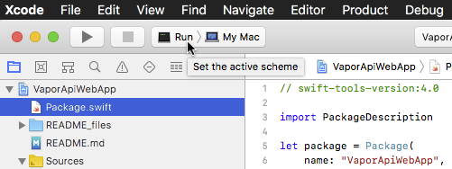

<p align="center">
    
    <br>
    <a href="https://docs.vapor.codes/2.0/getting-started/toolbox/#templates">
        
    </a>
    <a href="LICENSE">
        
    </a>
    <a href="https://swift.org">
        
    </a>
</p>

API + Web Template was initially created as a hybrid of [vapor/api-template](https://github.com/vapor/api-template) and [vapor/web-template](https://github.com/vapor/web-template).  This API (Fluent) + Web (Leaf) hybrid is currently setup as a starting point that can be used with Swift 4.0 and Xcode 9.

Example Routes
--------------

Example routes setup in the baseline template.

**API Fluent**

`http://localhost:8080/hello_api`  

```
{"hello":"world"}
```

`http://localhost:8080/plaintext_api`

```
Hello, world!
```  

`http://localhost:8080/info_api`  

**Web Leaf**

`http://localhost:8080/`  

`http://localhost:8080/info_web`  

`http://localhost:8080/hello_web/Sunshine`

``` html
<!DOCTYPE html>
<html>
<head>
	<title>Hello, Sunshine!</title>
	<link rel="stylesheet" href="/styles/app.css">
</head>
<body>

<h1>Hello, Sunshine!</h1>
</body>
</html>
```

Template Components
-------------------

### API Fluent Template

Fluent database components.

```
Sources/App/
  Controllers/
    PostController.swift
  Models/
    Post.swift
Tests/AppTests/
  PostControllerTests.swift
```

_Config/fluent.json_

``` json
"driver": "memory"
```


### Web Leaf Template

Leaf templating components.

```
Sources/App/
  Controllers/
    HelloController.swift
  Public/
    images/it-works.png
    styles/app.css
  Resources/Views/
    base_web.leaf
    hello_web.leaf
    welcome_web.leaf
Tests/AppTests/
  HelloControllerTests.swift
```

Use
---

``` sh
vapor new PROJECT_NAME --template=marc-medley/004.77_VaporApiWebTemplate
cd PROJECT_NAME
vapor update
```

Set the Xcode active scheme to `Run > My Mac`.




